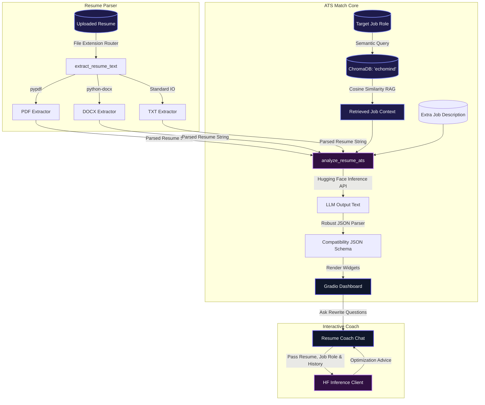
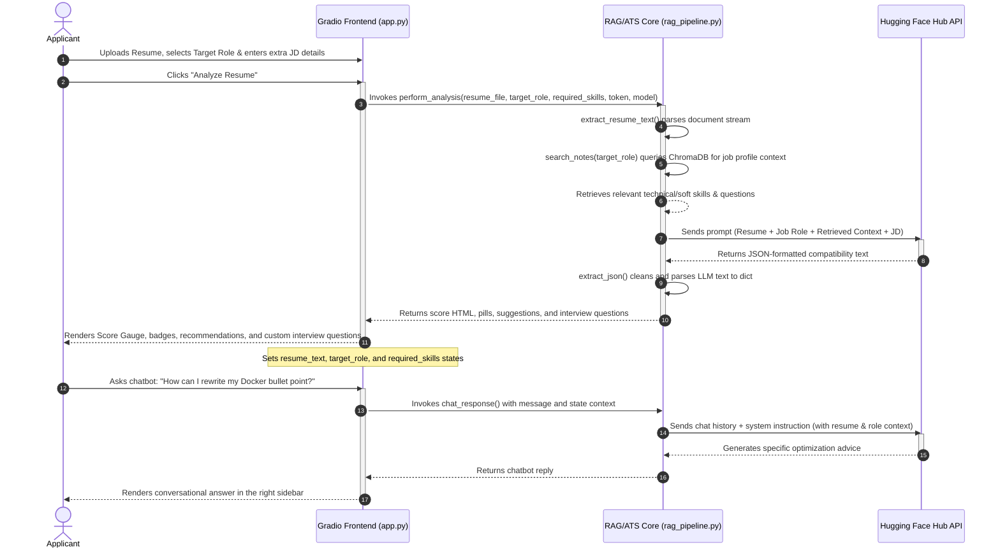

# 🔮 Technical Project Report: NaanChalant AI Resume ATS Analyzer (Hugging Face RAG Edition)
**A Semantic ATS Recruiter and Resume Optimization Consultant Powered by Hugging Face Serverless Inference API**

---

## 1. Executive Summary
**NaanChalant AI Resume ATS Analyzer** is a premium, split-dashboard web application designed to evaluate, score, and optimize professional resumes against targeted job roles and specific job descriptions. The system parses uploaded resumes in multiple formats (PDF, DOCX, TXT) and queries a localized **ChromaDB** index containing curated job-skill knowledge documents to retrieve the requirements of the specified job role.

It then leverages state-of-the-art open-source LLMs hosted on Hugging Face (such as `Qwen/Qwen2.5-72B-Instruct` or `Meta-Llama-3-8B-Instruct`) to calculate ATS compatibility scores, detect skill gaps, analyze keywords, identify formatting issues, output actionable edit suggestions, and generate tailored, role-specific technical and behavioral interview questions.

Additionally, a collapsible right-hand **Resume Coach Chatbot** acts as an interactive career consultant. It utilizes semantic RAG alongside the parsed resume context, allowing users to ask for real-time improvements, STAR-method bullet points, and key modifications.

---

## 2. System Architecture

The application is split into three core layers:
1. **Resume Extraction & Document Ingestion**: Parses uploads locally using `pypdf` and `python-docx` for word/text structures.
2. **Job-Skill Knowledge Ingestion (RAG)**: Ingests structured job profiles at startup from the `job_knowledge` database, creating dense embeddings (384-dim, `all-MiniLM-L6-v2`) stored in an in-memory ChromaDB client.
3. **Hugging Face ATS Evaluation Engine**: Employs structural prompting using the Hugging Face Inference API with a robust custom JSON extractor to process ATS scores, skill gaps, suggestions, and interview questions.

### A. High-Level Architecture
The diagram below illustrates the block-level architecture of the system:



---

### B. Conversation Sequence Diagram
This diagram shows the order of events when a user uploads a resume and triggers an analysis:



---

## 3. Database Schema & Vector Database Details
The local templates and job profile database utilizes **ChromaDB** in-memory to store structured resume writing guidelines, power-verbs, and role-specific requirements.

- **Collection Name**: `echomind`
- **Embedding Model**: `all-MiniLM-L6-v2` (SentenceTransformer)
  - **Type**: Dense Vector
  - **Dimensions**: 384 dimensions
  - **Distance Metric**: Cosine similarity
- **Data Chunking Configuration**:
  - **Chunk Size**: 300 characters
  - **Chunk Overlap**: 50 characters
  - **Splitter**: LangChain's `RecursiveCharacterTextSplitter`
- **Indexed Knowledge Files**:
  - `software_engineer.txt`: Fundamentals, languages, tools, and algorithms.
  - `data_scientist.txt`: Mathematics, statistics, machine learning, and databases.
  - `product_manager.txt`: Roadmaps, metrics, user research, and agile systems.
  - `devops_engineer.txt`: CI/CD, Kubernetes, IaC (Terraform), and monitoring.
  - `fullstack_developer.txt`: Next.js, React, Node.js, databases, and APIs.
  - `data_analyst.txt`: Advanced SQL, Excel, reporting, and BI tools (Tableau/Power BI).
  - `ui_ux_designer.txt`: Visual design, Figma, user testing, and components.
  - `security_engineer.txt`: App security, OWASP, cryptography, and network scanning.

---

## 4. Key Logic & Code Walkthrough

### A. Hugging Face Prompt Engineering & JSON Schema
Hugging Face models are instructed to return a structured JSON response matching the following schema:

```json
{
  "match_score": 85,
  "matching_skills": ["Python", "Docker", "Git"],
  "missing_skills": ["Kubernetes", "AWS EKS"],
  "keyword_analysis": "Excellent coverage of backend development terms...",
  "formatting_issues": ["Resume is missing a clear Summary section"],
  "recommendations": ["Add a certification in AWS...", "Integrate projects highlighting Kubernetes"],
  "interview_questions": [
    "Q1 (Technical): You mentioned experience with Docker. How would you design a multi-stage Dockerfile to minimize image size?",
    "Q2 (System Design): For a DevOps role, explain how you would manage secret storage in a Kubernetes cluster.",
    "Q3 (Behavioral): Describe a time when a production deployment failed and how you troubleshot it."
  ]
}
```

We implemented a robust extractor helper `extract_json()` that finds the first `{` and last `}` and cleans up unescaped newlines to ensure parsing does not fail if the model adds markdown wraps (e.g. ` ```json `).

### B. Custom Gradio UI Dashboard
We adapted the layout to support a dropdown for the **Target Job Role** (configured to accept custom typing entries via `allow_custom_value=True`) and added an **Interview Prep** tab to render the custom questions dynamically. Additionally, users can paste their API tokens directly in the UI settings or leverage the `.env` configuration.

---

## 5. Deployment Guide & Setup

### A. Environment Configuration
Create a `.env` file in the project root:
```env
HF_TOKEN=hf_YourHuggingFaceTokenHere
```

### B. Starting the Application
Launch the server using python directly:
```powershell
.\venv\Scripts\python app.py
```
Open your browser and navigate to:
```
http://localhost:7860
```
