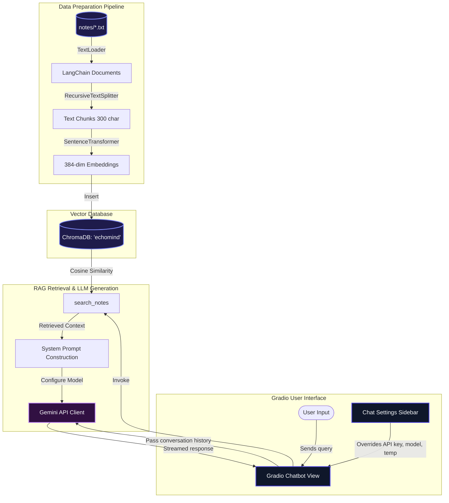
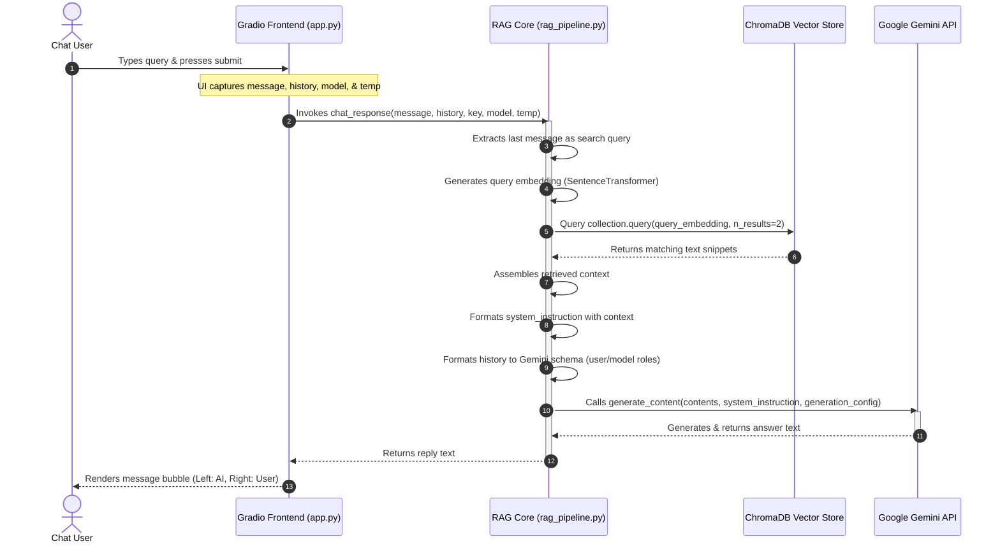

# 🔮 Technical Project Report: EchoMind AI Hub
**A Semantic RAG Agent Simulating MCP Local File Retrieval Powered by Google Gemini API**

---

## 1. Executive Summary
**EchoMind AI Hub** is a premium, multi-turn global conversational assistant implementing **Retrieval-Augmented Generation (RAG)**. The project is designed to simulate **Model Context Protocol (MCP)** local file access, allowing an LLM to dynamically retrieve context from local text databases on a per-query basis. 

The application is powered by the **Google Gemini API** (`gemini-2.5-flash`), built with **LangChain**, indexed using a client-side **ChromaDB** vector store, and exposed via an elegant **Gradio 6.0** web dashboard styled with custom glassmorphic aesthetics.

---

## 2. System Architecture

The EchoMind AI Hub is split into three core layers:
1. **Data Ingestion & Embedding Pipeline**: Converts raw text notes into semantic vectors.
2. **Vector Retrieval & Contextualization Layer**: Performs real-time cosine similarity search to retrieve relevant documents.
3. **LLM Generation & Interactive Interface**: Maps conversational history, dynamically injects system prompts, and renders the frontend.

### A. High-Level Architecture
The diagram below illustrates the block-level architecture of the system:



---

### B. Conversation Sequence Diagram
This diagram shows the order of events when a user submits a query to the chat interface:



---

## 3. Database Schema & Vector Database Details
The project utilizes **ChromaDB** in memory to store text metadata.

- **Collection Name**: `echomind`
- **Embedding Model**: `all-MiniLM-L6-v2` (SentenceTransformer)
  - **Type**: Dense Vector
  - **Dimensions**: 384 dimensions
  - **Distance Metric**: L2 (Squared Euclidean distance) / Cosine similarity
- **Data Chunking Configuration**:
  - **Chunk Size**: 300 characters
  - **Chunk Overlap**: 50 characters
  - **Splitter**: LangChain's `RecursiveCharacterTextSplitter` (splits by `\n\n`, `\n`, ` `, and `""` hierarchically)

### Database Storage Schema Layout
```
+-------------------------------------------------------+
| ID   | Document Text                  | Embedding     |
+------+--------------------------------+---------------+
| "0"  | "I prepared for interviews..." | [0.04, -0.12] |
| "1"  | "In 2027 I want to become..."  | [0.08, -0.01] |
+------+--------------------------------+---------------+
```

---

## 4. Key Logic & Code Walkthrough

### A. Dynamic RAG Prompt Engineering
Retrieved documents are injected dynamically into the model's `system_instruction` at the initialization stage of each generation call. The instruction includes rules for hybrid grounding:

```python
system_instruction = f"""You are EchoMind AI, a premium conversational assistant.
You have semantic access to the user's local notes (simulating MCP file access).

Relevant retrieved snippets from local notes:
{context}

Guidelines:
- If the user is asking about their personal notes, activities, plans, or journal, answer based on the retrieved snippets.
- If the query is general (e.g. Java programming, coding, math, general knowledge), answer fully and accurately using your general intelligence. Ignore the retrieved notes if they are not relevant.
- Be conversational, helpful, and concise.
"""
```

### B. Gradio 6.0 Custom Theme & Styling
We applied Custom CSS to override the browser defaults and establish a high-end, responsive dark interface:

```css
/* Styling User Bubbles (Right-aligned, vibrant Indigo gradient) */
#chatbot-view .message.user {
    background: linear-gradient(135deg, #4f46e5 0%, #6366f1 100%) !important;
    color: #ffffff !important;
    border-radius: 20px 20px 4px 20px !important;
    box-shadow: 0 4px 15px rgba(99, 102, 241, 0.3) !important;
    margin-left: auto !important;
    max-width: 75% !important;
}

/* Styling Assistant Bubbles (Left-aligned, glass slate background) */
#chatbot-view .message.assistant {
    background: rgba(30, 41, 59, 0.7) !important;
    color: #f1f5f9 !important;
    border-radius: 20px 20px 20px 4px !important;
    border: 1px solid rgba(255, 255, 255, 0.08) !important;
    margin-right: auto !important;
    max-width: 75% !important;
}
```

### C. Execution Guard Check
To prevent port locking and user error if they attempt to launch the Gradio app under Streamlit's runtime engine:
```python
import sys
# Guard against running with Streamlit
if any("streamlit" in arg for arg in sys.argv) or "streamlit" in sys.modules:
    try:
        import streamlit as st
        st.error("⚠️ **EchoMind has been migrated to Gradio!**")
        st.info("Please do not run this script with `streamlit run app.py`.")
        st.stop()
    except Exception:
        pass
```

---

## 5. Deployment Guide & Setup

### A. Environment Configuration
Create a `.env` file in the project root:
```env
GEMINI_API_KEY=AIzaSy...
```

### B. Starting the Application
Launch the server using python directly:
```powershell
.\venv\Scripts\python app.py
```
Open your browser and navigate to:
```
http://localhost:7860
```

---

## 6. Hybrid System Validation Results

| Query Checked | Retrieval Triggered? | AI Model Routing Behavior |
| :--- | :--- | :--- |
| **"What were my biggest college fears?"** | Yes (retrieved `notes/college_journal.txt`) | Reads context facts, returns "Your biggest fear was public speaking..." |
| **"Help me learn Java"** | No matching facts retrieved | Ignores context, returns complete general programming syntax tutorial. |
| **"Japan trip details"** | Yes, but no matching context found | Responds groundedly: "I couldn't find any mention of a Japan trip in your files." |
| **"Write a Python bubble sort"** | No matching facts retrieved | Generates clean Python code block. |
